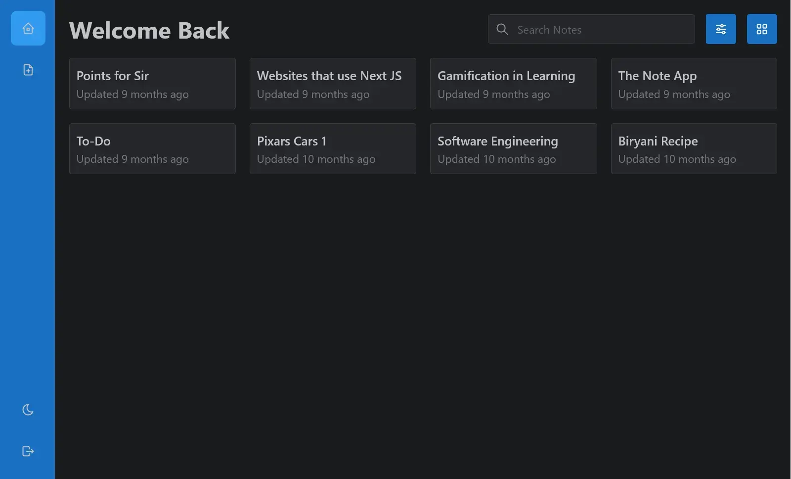

## Project Overview

---



This is a simple and user-friendly note-taking app I made while I was learning the MERN stack (MongoDB, Express JS, React JS, Node JS). Development time was almost 1 month: started on the 28th of August, 2023, and ended on the 23rd of September, 2023. This was also my first time using a component library and I chose Mantine as it fit my style. I still prefer using plain TailwindCSS with HeroIcons.

## Technologies Used

---

-   React JS
-   Express JS
-   Node JS
-   MongoDB
-   Mongoose
-   Mantine UI
-   Vite PWA

## Hosting

---

**Frontend React App** - This was deployed on Netlify. I've been using their free plan for a year now and it gets the job done. Netlify also rebuilds the site every time a new commit to this repository is made. [Check it out!](https://digidiary.netlify.app/)

**Backend Express App** - This was deployed on Render. This was my first time using Render and it seems to work well. The backend app does spin down after 15 minutes of inactivity but you can't ask for more from a free plan.

## Architecture

---


As with most other MERN Stack apps, DigiDiary uses a MVC architecture, which is an acronym for Model-View-Controller. As the name suggests, the system is broken into 3 main components that are highly dependent on each other. From my understanding, I'm guessing this is very good as development would be faster because there could be 3 teams working simultaneously on a project.

### Models

---

The Model part of MVC deals with data logic and business logic. The data logic is the storing, retrieving, and manipulating of data from a database, MongoDB in this case. On the other hand, business logic refers to how this data is processed. The model acts as a link between the controller and the database as the controllers can't directly interact with the database itself. Mongoose is used to do all of this.

### Views

---

The view part handles the UI logic and generates UI components for the user based on the data collected by the model. This data is obtained from the controller and not the model itself. Some of the main views for this app are the home page(where all the created notes are displayed) and the edit page, where(the note data is displayed).
Feel free to check out the final version if you want to have a look.

</details>

### Controllers

---

Controllers are the functions that act as a link between the model and view. It takes the input from the user and forwards it to the model to use it. It then sends a response back to the user after the model is done doing its thing. Responses can be either a success or failure, whereby the error needs to be handled. Here is. Here is an example of a controller for creating notes:

```js
const createNote = async (req, res) => {
    const { title, content } = req.body;

    try {
        checkMissingFields(req);

        const note = await noteModel.create({
            title,
            content,
            owner: req.user._id;
        });

        res.status(200).json(note);
    } catch (err) {
        res.status(400).json(err.message);
    }
};
```

This app has a controller for each of the primary interactions between the user and the system. These interactions are also called "use cases" and I have made a use-case diagram for this app:

## Getting Started

---

Firstly, fork this repository and then clone it onto your machine. Then, cd into the client folder and run `npm install `. Now cd out to the root folder and cd into the server folder and run `npm install` again. Create a `.env` file in the root of the server folder and add the environment variables:

```
PORT=4000
MONGO
SECRET
```

The backend routes for the Express app are hardcoded in the `client/src/hooks/controllers/useNoteController` file for all 6 controllers, change it to your own backend routes.

```js
const res = await axios.get("https://digidiary.onrender.com/api/notes");
```

After setting up the environment and adding your backend routes, run `npm start` to run the app.

## Acknowledgments

---

Special thanks to Aaryan, Danvil, Ilisoni, Indeevar, Mesake, Rohan, Veer, and Vetaia (I am nothing without my boys).

## Learning Resources

---

-   [MERN stack full tutorial and project](https://www.youtube.com/watch?v=CvCiNeLnZ00)
-   [MVC pattern explained in Node JS](https://www.youtube.com/watch?v=bQuBlR0T5cc)
-   [MongoDB in 100 seconds](https://www.youtube.com/watch?v=-bt_y4Loofg)
